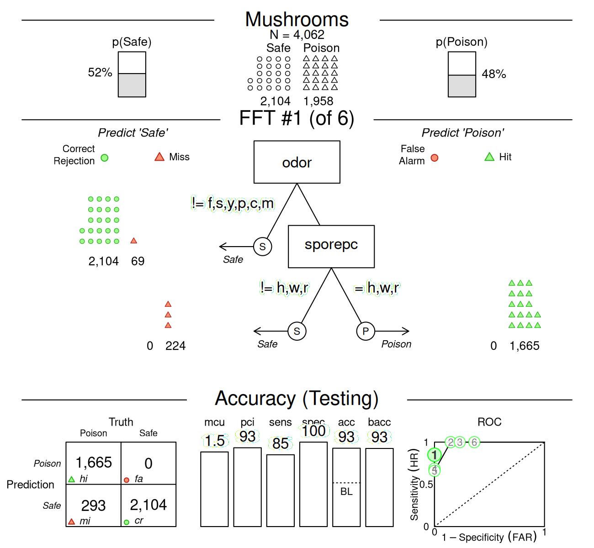

# Examples of FFTrees

## Examples of FFTs with **FFTrees**

This vignette illustrates how to construct fast-and-frugal trees (FFTs)
for additional datasets included in the **FFTrees** package. (See
Phillips et al., 2017, for a comparison across 10 real-world datasets.)

### Mushrooms data


The `mushrooms` dataset contains data about mushrooms (see
[`?mushrooms`](https://www.nathanieldphillips.co/FFTrees/reference/mushrooms.md)
for details). The goal of our model is to predict which mushrooms are
`poisonous` based on 22 cues ranging from the mushroom’s odor, color,
etc.

Here are the first few rows and a subset of 10 potential predictors of
the `mushrooms` data:

| poisonous | cshape | csurface | ccolor | bruises | odor | vcolor | ringnum | ringtype | sporepc | population | habitat |
|:----------|:-------|:---------|:-------|:--------|:-----|:-------|:--------|:---------|:--------|:-----------|:--------|
| TRUE      | x      | s        | n      | TRUE    | p    | w      | o       | p        | k       | s          | u       |
| FALSE     | x      | s        | y      | TRUE    | a    | w      | o       | p        | n       | n          | g       |
| FALSE     | b      | s        | w      | TRUE    | l    | w      | o       | p        | n       | n          | m       |
| TRUE      | x      | y        | w      | TRUE    | p    | w      | o       | p        | k       | s          | u       |
| FALSE     | x      | s        | g      | FALSE   | n    | w      | o       | e        | n       | a          | g       |
| FALSE     | x      | y        | y      | TRUE    | a    | w      | o       | p        | k       | n          | g       |

**Table 1**: Binary criterion variable `poisonous` and 10 potential
predictors in the `mushrooms` data.

#### Creating FFTs

Let’s create some trees using
[`FFTrees()`](https://www.nathanieldphillips.co/FFTrees/reference/FFTrees.md)!
We’ll use the `train.p = .50` argument to split the original data into a
$50$% training set and a $50$% testing set:

``` r
# Create FFTs from the mushrooms data: 
set.seed(1) # for replicability of the training / test data split

mushrooms_fft <- FFTrees(formula = poisonous ~.,
                         data = mushrooms,
                         train.p = .50,   # split data into 50:50 training/test subsets
                         main = "Mushrooms",
                         decision.labels = c("Safe", "Poison"))
```

Here’s basic information about the best performing FFT (Tree #1):

``` r
# Print information about the best tree (during training):
print(mushrooms_fft)
```

    #> Mushrooms
    #> FFTrees 
    #> - Trees: 6 fast-and-frugal trees predicting poisonous
    #> - Cost of outcomes:  hi = 0,  fa = 1,  mi = 1,  cr = 0
    #> - Cost of cues: 
    #>     cshape   csurface     ccolor    bruises       odor    gattach     gspace 
    #>          1          1          1          1          1          1          1 
    #>      gsize     gcolor     sshape      sroot    ssaring    ssbring    scaring 
    #>          1          1          1          1          1          1          1 
    #>    scbring      vtype     vcolor    ringnum   ringtype    sporepc population 
    #>          1          1          1          1          1          1          1 
    #>    habitat 
    #>          1 
    #> 
    #> FFT #1: Definition
    #> [1] If odor != {f,s,y,p,c,m}, decide Safe.
    #> [2] If sporepc = {h,w,r}, decide Poison, otherwise, decide Safe.
    #> 
    #> FFT #1: Training Accuracy
    #> Training data: N = 4,062, Pos (+) = 1,958 (48%) 
    #> 
    #> |          | True +   | True -   |   Totals:
    #> |----------|----------|----------|
    #> | Decide + | hi 1,683 | fa     0 |     1,683
    #> | Decide - | mi   275 | cr 2,104 |     2,379
    #> |----------|----------|----------|
    #>   Totals:       1,958      2,104   N = 4,062
    #> 
    #> acc  = 93.2%   ppv  = 100.0%   npv  = 88.4%
    #> bacc = 93.0%   sens = 86.0%   spec = 100.0%
    #> 
    #> FFT #1: Training Speed, Frugality, and Cost
    #> mcu = 1.47,  pci = 0.93
    #> cost_dec = 0.068,  cost_cue = 1.469,  cost = 1.537

[Cool beans](https://goo.gl/B7YDuC).

#### Visualizing cue accuracies

Let’s look at the individual cue training accuracies with
`plot(fft, what = "cues")`:

``` r
# Plot the cue accuracies of an FFTrees object:
plot(mushrooms_fft, what = "cues")
```

    #> Plotting cue training statistics:
    #> — Cue accuracies ranked by bacc
    #> 


It looks like the cues `oder` and `sporepc` are the best predictors. In
fact, the single cue `odor` has a hit rate of $97$% and a false alarm
rate of nearly $0$%! Based on this, we should expect the final trees to
use just these cues.

#### Visualizing FFT performance

Now let’s plot the performance of the best training tree when applied to
the test data:

``` r
# Plot the best FFT (for test data): 
plot(mushrooms_fft, data = "test")
```



Indeed, it looks like the best tree only uses the `odor` and `sporepc`
cues. In our test dataset, the tree had a *false alarm rate* of $0$%
($1 -$ specificity), and a *sensitivity* (aka. hit rate) of $85$%.

#### Trading off prediction errors

When considering the implications of our predictions, the fact that our
FFT incurs many misses, but no false alarms, is problematic: Given our
current task, failing to detect poisonous mushrooms has usually more
serious consequences than falsely classifying some as poisonous. To
change the balance between both possible errors, we can select another
tree from the set of FFTs. In this case, FFT #2 would use the same two
cues, but alter their exit structure so that our prediction incurs false
alarms, but no misses. Alternatively, we could re-generate a new set of
FFTs with a higher sensitivity weight value (e.g., increase the default
value of `sens.w = .50` to `sens.w = .67`) and optimize the FFTs’
weighted accuracy `wacc`.

#### An alternative FFT

Let’s assume that a famous mushroom expert insists that our FFT is using
the wrong cues. According to her, the best predictors for poisonous
mushrooms are `ringtype` and `ringnum`. To test this, we build a set of
FFTs from only these cues and check how they perform relative to our
initial tree:

``` r
# Create trees using only the ringtype and ringnum cues: 
mushrooms_ring_fft <- FFTrees(formula = poisonous ~ ringtype + ringnum,
                              data = mushrooms,
                              train.p = .50,
                              main = "Mushrooms (ring cues)",
                              decision.labels = c("Safe", "Poison"))
```

Again, we plot the best training tree, when predicting the cases in the
test dataset:

``` r
# Plotting the best training FFT (for test data): 
plot(mushrooms_ring_fft, data = "test")
```


As we can see, this tree (in `mushrooms_ring_fft`) has both sensitivity
and specificity values of around $80$%, but does not perform as well as
our earlier one (in `mushrooms_fft`). This suggests that we should
discard the expert’s advice and primarily rely on the `odor`
and `sporepc` cues.

### Iris.v data


The `iris.v` dataset contains data about 150 flowers (see
[`?iris.v`](https://www.nathanieldphillips.co/FFTrees/reference/iris.v.md)).
Our goal is to predict which flowers are of the class *Virginica*. In
this example, we’ll create trees using the entire dataset (without
splitting the available data into explicit training vs. test subsets),
so that we are really fitting the data, rather than engaging in genuine
prediction:

``` r
# Create FFTrees object for iris data:
iris_fft <- FFTrees(formula = virginica ~.,
                    data = iris.v,
                    main = "Iris viginica",
                    decision.labels = c("Not-Vir", "Vir"))
```

The **FFTrees** package provides various functions to inspect the
`FFTrees` object `iris_fft`. For summary information on the best
training tree, we can print the `FTrees` object (by evaluating
`iris_fft` or `print(iris_fft)`). Alternatively, we could visualize the
tree (via `plot(iris_fft)`) or summarize the `FFTrees` object (via
`summary(iris_fft)`):

``` r
# Inspect resulting FFTs: 
print(iris_fft)    # summarize best training tree
plot(iris_fft)     # visualize best training tree
summary(iris_fft)  # summarize FFTrees object
```

However, let’s first take a look at the individual training cue
accuracies…

#### Visualizing cue accuracies

We can plot the training cue accuracies during training by specifying
`what = "cues"`:

``` r
# Plot cue values: 
plot(iris_fft, what = "cues")
```

    #> Plotting cue training statistics:
    #> — Cue accuracies ranked by bacc
    #> 


It looks like the two cues `pet.len` and `pet.wid` are the best
predictors for this dataset. Based on this insight, we should expect the
final trees will likely use one or both of these cues.

#### Visualizing FFT performance

Now let’s visualize the best tree:

``` r
# Plot best FFT: 
plot(iris_fft)
```


Indeed, it turns out that the best tree only uses the `pet.len`
and `pet.wid` cues (in that order). For this data, the fitted tree
exhibits a performance with a sensitivity of 100% and a specificity
of 94%.

#### Viewing alternative FFTs

Now, this tree did quite well, but what if someone wanted a tree with
the lowest possible false alarm rate? If we inspect the ROC plot in the
bottom right corner of the figure, we see that Tree #2 has a specificity
close to 100%. Let’s plot this tree:

``` r
# Plot FFT #2: 
plot(iris_fft, tree = 2)
```


As we can see, this tree does indeed have a higher specificity (of 98%),
but this increase comes at a cost of a lower sensitivity (of 90%). Such
trade-offs between conflicting measures are inevitable when fitting and
predicting real-world data. Importantly, using FFTs and the **FFTrees**
package help us to render such trade-offs more transparent.

### Titanic data

For examples that predict people’s survival of the *Titanic* disaster
(by growing FFTs for the `titanic` data), see the [Visualizing
FFTs](https://www.nathanieldphillips.co/FFTrees/articles/FFTrees_plot.md)
vignette.

## Vignettes

Here is a complete list of the vignettes available in the **FFTrees**
package:

|     | Vignette                                                                                                 | Description                                                                                                                        |
|----:|:---------------------------------------------------------------------------------------------------------|:-----------------------------------------------------------------------------------------------------------------------------------|
|     | [Main guide: FFTrees overview](https://www.nathanieldphillips.co/FFTrees/articles/guide.md)              | An overview of the **FFTrees** package                                                                                             |
|   1 | [Tutorial: FFTs for heart disease](https://www.nathanieldphillips.co/FFTrees/articles/FFTrees_heart.md)  | An example of using [`FFTrees()`](https://www.nathanieldphillips.co/FFTrees/reference/FFTrees.md) to model heart disease diagnosis |
|   2 | [Accuracy statistics](https://www.nathanieldphillips.co/FFTrees/articles/FFTrees_accuracy_statistics.md) | Definitions of accuracy statistics used throughout the package                                                                     |
|   3 | [Creating FFTs with FFTrees()](https://www.nathanieldphillips.co/FFTrees/articles/FFTrees_function.md)   | Details on the main [`FFTrees()`](https://www.nathanieldphillips.co/FFTrees/reference/FFTrees.md) function                         |
|   4 | [Manually specifying FFTs](https://www.nathanieldphillips.co/FFTrees/articles/FFTrees_mytree.md)         | How to directly create FFTs without using the built-in algorithms                                                                  |
|   5 | [Visualizing FFTs](https://www.nathanieldphillips.co/FFTrees/articles/FFTrees_plot.md)                   | Plotting `FFTrees` objects, from full trees to icon arrays                                                                         |
|   6 | [Examples of FFTs](https://www.nathanieldphillips.co/FFTrees/articles/FFTrees_examples.md)               | Examples of FFTs from different datasets contained in the package                                                                  |

## References

Phillips, N. D., Neth, H., Woike, J. K., & Gaissmaier, W. (2017).
FFTrees: A toolbox to create, visualize, and evaluate fast-and-frugal
decision trees. *Judgment and Decision Making*, *12*(4), 344–368.
<https://doi.org/10.1017/S1930297500006239>
