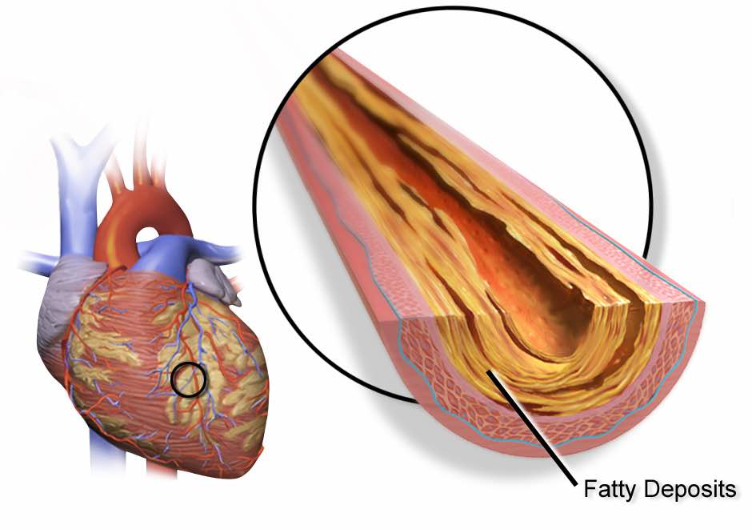
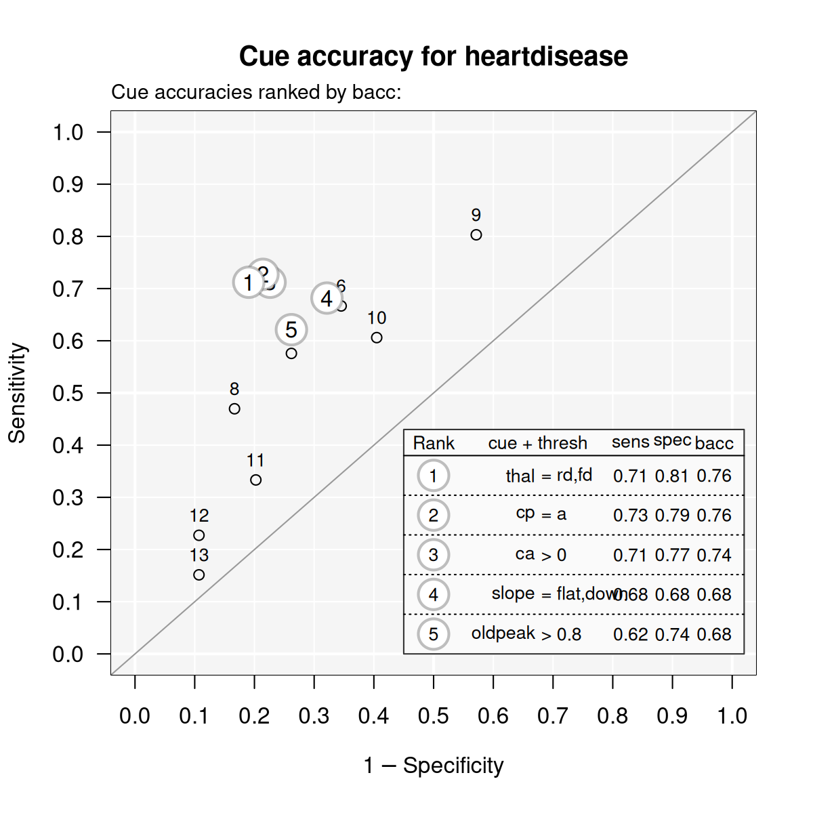
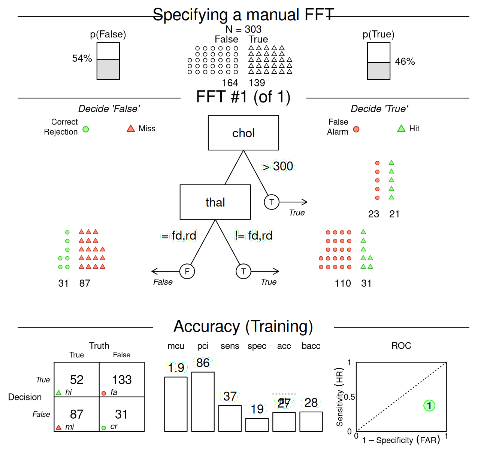

# Creating FFTs with FFTrees()

## Details on the `FFTrees()` function

This vignette starts by building a fast-and-frugal tree (FFT) from the
`heartdisease` data — also used in the [Tutorial: FFTs for heart
disease](https://www.nathanieldphillips.co/FFTrees/articles/FFTrees_heart.md)
and Phillips et al. (2017) — but then explores additional aspects of the
[`FFTrees()`](https://www.nathanieldphillips.co/FFTrees/reference/FFTrees.md)
function.

The goal of the
[`FFTrees()`](https://www.nathanieldphillips.co/FFTrees/reference/FFTrees.md)
function is to create FFTs from data and record all details of the
problem specification, tree definitions, the classification process, and
performance measures in an `FFTrees` object. As
[`FFTrees()`](https://www.nathanieldphillips.co/FFTrees/reference/FFTrees.md)
can handle two sets of data (for training vs. testing) and creates a
range of FFTs, each with distinct process and performance
characteristics, evaluating the function may take some time (typically a
few seconds) and the structure of the resulting `FFTrees` object is
quite complex. But as
[`FFTrees()`](https://www.nathanieldphillips.co/FFTrees/reference/FFTrees.md)
is at the heart of the **FFTrees** package, it pays to understand its
arguments and the structure of an `FFTrees` object.

### Example: Predicting heart disease

An FFT generally addresses binary classification problems: It attempts
to classify the outcomes of a *criterion* variable into one of two
classes (i.e., True or False) based on a range of potential *predictor*
variables (aka. cues or features). A corresponding problem from the
domain of clinical diagnostics is:

- Which patient has heart disease, given some data on patients’ general
  health and diagnostic symptoms?



To address this problem, the **FFTrees** package includes the
`heartdisease` data. But rather than using the full dataset to fit our
FFTs, we have split the data into a training set (`heart.train`), and
test set (`heart.test`). Here is a peak at the corresponding data
frames:

``` r
# Training data: 
head(heart.train)
```

    #> # A tibble: 6 × 14
    #>   diagnosis   age   sex cp    trestbps  chol   fbs restecg thalach exang oldpeak
    #>   <lgl>     <dbl> <dbl> <chr>    <dbl> <dbl> <dbl> <chr>     <dbl> <dbl>   <dbl>
    #> 1 FALSE        44     0 np         108   141     0 normal      175     0     0.6
    #> 2 FALSE        51     0 np         140   308     0 hypert…     142     0     1.5
    #> 3 FALSE        52     1 np         138   223     0 normal      169     0     0  
    #> 4 TRUE         48     1 aa         110   229     0 normal      168     0     1  
    #> 5 FALSE        59     1 aa         140   221     0 normal      164     1     0  
    #> 6 FALSE        58     1 np         105   240     0 hypert…     154     1     0.6
    #> # ℹ 3 more variables: slope <chr>, ca <dbl>, thal <chr>

``` r
# Testing data:
head(heart.test)
```

    #> # A tibble: 6 × 14
    #>   diagnosis   age   sex cp    trestbps  chol   fbs restecg thalach exang oldpeak
    #>   <lgl>     <dbl> <dbl> <chr>    <dbl> <dbl> <dbl> <chr>     <dbl> <dbl>   <dbl>
    #> 1 FALSE        51     0 np         120   295     0 hypert…     157     0     0.6
    #> 2 TRUE         45     1 ta         110   264     0 normal      132     0     1.2
    #> 3 TRUE         53     1 a          123   282     0 normal       95     1     2  
    #> 4 TRUE         45     1 a          142   309     0 hypert…     147     1     0  
    #> 5 FALSE        66     1 a          120   302     0 hypert…     151     0     0.4
    #> 6 TRUE         48     1 a          130   256     1 hypert…     150     1     0  
    #> # ℹ 3 more variables: slope <chr>, ca <dbl>, thal <chr>

The critical dependent variable (or binary criterion variable) is
`diagnosis`. This variable indicates whether a patient has heart disease
(`diagnosis = TRUE`) or not (`diagnosis = FALSE`). All other variables
in the dataset (e.g., `sex`, `age`, and several biological measurements)
can be used as predictors (aka. cues).

### Creating trees with `FFTrees()`

To illustrate the difference between fitting and prediction, we will
*train* the FFTs on `heart.train`, and *test* their prediction
performance in `heart.test`. Note that we can also automate the training
/ test split using the `train.p` argument in
[`FFTrees()`](https://www.nathanieldphillips.co/FFTrees/reference/FFTrees.md).
Setting `train.p` will randomly split `train.p`% of the original data
into a training set.

To create a set of FFTs, we use the
[`FFTrees()`](https://www.nathanieldphillips.co/FFTrees/reference/FFTrees.md)
function to create a new `FFTrees` object called `heart.fft`. Here, we
specify `diagnosis` as the binary criterion (or dependent variable), and
include all other (independent) variables with
`formula = diagnosis ~ .`:

``` r
# Create an FFTrees object called heart.fft predicting diagnosis: 
heart.fft <- FFTrees(formula = diagnosis ~.,
                     data = heart.train,
                     data.test = heart.test)
```

If we wanted to only consider specific variables, like `sex` and `age`,
for our trees, we could specify `formula = diagnosis ~ age + sex`.

### Elements of an `FFTrees` object

The
[`FFTrees()`](https://www.nathanieldphillips.co/FFTrees/reference/FFTrees.md)
function returns an object of the `FFTrees` class. There are many
elements in an `FFTrees` object. We can obtain these elements by
printing their names:

``` r
# See the elements of an FFTrees object:
names(heart.fft)
```

    #> [1] "criterion_name" "cue_names"      "formula"        "trees"         
    #> [5] "data"           "params"         "competition"    "cues"

Inspecting these elements provides a wealth of information on the range
of FFTs contained in the current `FFTrees` object:

1.  `criterion_name`: The name of the (predicted) binary criterion
    variable.

2.  `cue_names`: The names of all potential cue variables (predictors)
    in the data.

3.  `formula`: The formula used to create the `FFTrees` object.

4.  `trees`: Information on all trees contained in the object, with list
    elements that specify their number `n`, the `best` tree, as well as
    tree `definitions`, verbal descriptions (`inwords`), `decisions`,
    and the performance characteristics (`stats` and `level_stats`) of
    each FFT.

5.  `data`: The datasets used to `train` and `test` the FFTs (if
    applicable).

6.  `params`: The parameters used for constructing FFTs (currently 19
    parameters).

7.  `competition`: Models and statistics of alternative classification
    algorithms (for `test`, `train`, and `models`).

8.  `cues`: Information on all cue variables (predictors), with list
    elements that specify their `thresholds` and performance `stats`
    when training FFTs.

### Basic performance characteristics of FFTs

We can view basic information about the `FFTrees` object by printing its
name. As the default tree construction algorithm `ifan` creates multiple
trees with different exit structures, an `FFTrees` object typically
contains many FFTs.

When printing an `FFTrees` object, we automatically see the performance
on the *training* data (i.e., for *fitting*, rather than *prediction*)
and obtain the information about the tree with the highest value of the
`goal` statistic. By default, the `goal` is set to weighed
accuracy `wacc`:

``` r
# Training performance of the best tree (on "train" data, given current goal):
heart.fft  # same as: print(heart.fft, data = "train")
```

    #> FFTrees 
    #> - Trees: 7 fast-and-frugal trees predicting diagnosis
    #> - Cost of outcomes:  hi = 0,  fa = 1,  mi = 1,  cr = 0
    #> - Cost of cues: 
    #>      age      sex       cp trestbps     chol      fbs  restecg  thalach 
    #>        1        1        1        1        1        1        1        1 
    #>    exang  oldpeak    slope       ca     thal 
    #>        1        1        1        1        1 
    #> 
    #> FFT #1: Definition
    #> [1] If thal = {rd,fd}, decide True.
    #> [2] If cp != {a}, decide False.
    #> [3] If ca > 0, decide True, otherwise, decide False.
    #> 
    #> FFT #1: Training Accuracy
    #> Training data: N = 150, Pos (+) = 66 (44%) 
    #> 
    #> |          | True + | True - | Totals:
    #> |----------|--------|--------|
    #> | Decide + | hi  54 | fa  18 |      72
    #> | Decide - | mi  12 | cr  66 |      78
    #> |----------|--------|--------|
    #>   Totals:        66       84   N = 150
    #> 
    #> acc  = 80.0%   ppv  = 75.0%   npv  = 84.6%
    #> bacc = 80.2%   sens = 81.8%   spec = 78.6%
    #> 
    #> FFT #1: Training Speed, Frugality, and Cost
    #> mcu = 1.74,  pci = 0.87
    #> cost_dec = 0.200,  cost_cue = 1.740,  cost = 1.940

Before interpreting any model output, we need to carefully distinguish
between an FFT’s “Training” (for fitting training data) and “Prediction”
performance (for new test data). Unless we explicitly ask for
`print(heart.fft, data = "test")`, the output of printing `heart.fft`
will report on the fitting phase (i.e., `data = "train"` by default). To
see the corresponding prediction performance, we could alternatively ask
for:

``` r
# Prediction performance of the best training tree (on "test" data): 
print(heart.fft, data = "test")
```

When evaluating an FFT for either training or test data, we obtain a
wide range of measures.

After some general information on the `FFTrees` object, we see a verbal
**Definition** of the best FFT (FFT #1). Key information for evaluating
an FFT’s performance is contained in the **Accuracy** panel (for either
training or prediction). Here is a description of the frequency counts
and corresponding statistics provided:

| Statistic        | Long name                    | Definition                                                                                                                                                                    |
|:-----------------|:-----------------------------|:------------------------------------------------------------------------------------------------------------------------------------------------------------------------------|
| *Frequencies*:   |                              |                                                                                                                                                                               |
| `hi`             | Number of hits               | $N\left( \text{Decision} = 1 \land \text{Truth} = 1 \right)$                                                                                                                  |
| `mi`             | Number of misses             | $N\left( \text{Decision} = 0 \land \text{Truth} = 1 \right)$                                                                                                                  |
| `fa`             | Number of false-alarms       | $N\left( \text{Decision} = 1 \land \text{Truth} = 0 \right)$                                                                                                                  |
| `cr`             | Number of correct rejections | $N\left( \text{Decision} = 0 \land \text{Truth} = 0 \right)$                                                                                                                  |
| `N`              | Number of cases              | The total number of cases considered.                                                                                                                                         |
| *Probabilities*: |                              |                                                                                                                                                                               |
| `acc`            | Accuracy                     | The percentage of cases that were correctly classified.                                                                                                                       |
| `ppv`            | Positive predictive value    | The percentage (or conditional probability) of positive decisions being correct (i.e., True + cases).                                                                         |
| `npv`            | Negative predictive value    | The percentage (or conditional probability) of negative decisions being correct (i.e., True - cases).                                                                         |
| `wacc`           | Weighted accuracy            | The weighted average of sensitivity and specificity, where sensitivity is weighted by `sens.w` (by default, `sens.w = .50`).                                                  |
| `sens`           | Sensitivity                  | The percentage (or conditional probability) of true positive cases being correctly classified.                                                                                |
| `spec`           | Specificity                  | The percentage (or conditional probability) of true negative cases being correctly classified.                                                                                |
| *Frugality*:     |                              |                                                                                                                                                                               |
| `mcu`            | Mean cues used               | On average, how many cues were needed to classify cases? In other words, what percent of the available information was used on average?                                       |
| `pci`            | Percent cues ignored         | The percent of data that was *ignored* when classifying cases with a given tree. This is identical to `mcu / cues.n`, where `cues.n` is the total number of cues in the data. |

**Table 1**: Description of FFTs’ basic frequencies and corresponding
accuracy and speed/frugality statistics.

To obtain the same information for *another* FFT of an `FFTrees` object,
we can call [`print()`](https://rdrr.io/r/base/print.html) with a
numeric `tree` parameter. For instance, the following expression would
provide the basic performance characteristics of Tree 3:

``` r
# Performance of alternative FFTs (Tree 3) in an FFTrees object: 
print(heart.fft, tree = 3, data = "test")
```

Alternatively, we could visualize the same tree and its performance
characteristics by calling `plot(heart.fft, tree = 3, data = "test")`.

See the [Accuracy
statistics](https://www.nathanieldphillips.co/FFTrees/articles/FFTrees_accuracy_statistics.md)
vignette for details on the accuracy statistics used throughout the
**FFTrees** package.

### Cue performance information

Each FFT has a decision threshold for each cue (regardless of whether or
not it is actually used in the tree) that maximizes the `goal` value of
that cue when it is applied to the entire training dataset. We can
obtain cue accuracy statistics using the calculated decision thresholds
from the `cue.accuracies` list. If the object has test data, we can see
the marginal cue accuracies in the test data (using the thresholds
calculated from the training data):

``` r
# Decision thresholds and marginal classification training accuracies for each cue: 
heart.fft$cues$stats$train
```

    #>         cue     class            threshold direction   n hi fa mi cr      sens
    #> 1       age   numeric                   57         > 150 38 22 28 62 0.5757576
    #> 2       sex   numeric                    0         > 150 53 48 13 36 0.8030303
    #> 3        cp character                    a         = 150 48 18 18 66 0.7272727
    #> 4  trestbps   numeric                  148         > 150 15  9 51 75 0.2272727
    #> 5      chol   numeric                  273         > 150 22 17 44 67 0.3333333
    #> 6       fbs   numeric                    0         > 150 10  9 56 75 0.1515152
    #> 7   restecg character hypertrophy,abnormal         = 150 40 34 26 50 0.6060606
    #> 8   thalach   numeric                  154        <= 150 44 29 22 55 0.6666667
    #> 9     exang   numeric                    0         > 150 31 14 35 70 0.4696970
    #> 10  oldpeak   numeric                  0.8         > 150 41 22 25 62 0.6212121
    #> 11    slope character            flat,down         = 150 45 27 21 57 0.6818182
    #> 12       ca   numeric                    0         > 150 47 19 19 65 0.7121212
    #> 13     thal character                rd,fd         = 150 47 16 19 68 0.7121212
    #>         spec       ppv       npv       acc      bacc      wacc    dprime
    #> 1  0.7380952 0.6333333 0.6888889 0.6666667 0.6569264 0.6569264 0.8227611
    #> 2  0.4285714 0.5247525 0.7346939 0.5933333 0.6158009 0.6158009 0.6653742
    #> 3  0.7857143 0.7272727 0.7857143 0.7600000 0.7564935 0.7564935 1.3853056
    #> 4  0.8928571 0.6250000 0.5952381 0.6000000 0.5600649 0.5600649 0.4882880
    #> 5  0.7976190 0.5641026 0.6036036 0.5933333 0.5654762 0.5654762 0.3996338
    #> 6  0.8928571 0.5263158 0.5725191 0.5666667 0.5221861 0.5221861 0.2105078
    #> 7  0.5952381 0.5405405 0.6578947 0.6000000 0.6006494 0.6006494 0.5065806
    #> 8  0.6547619 0.6027397 0.7142857 0.6600000 0.6607143 0.6607143 0.8230087
    #> 9  0.8333333 0.6888889 0.6666667 0.6733333 0.6515152 0.6515152 0.8840984
    #> 10 0.7380952 0.6507937 0.7126437 0.6866667 0.6796537 0.6796537 0.9394337
    #> 11 0.6785714 0.6250000 0.7307692 0.6800000 0.6801948 0.6801948 0.9297212
    #> 12 0.7738095 0.7121212 0.7738095 0.7466667 0.7429654 0.7429654 1.3009993
    #> 13 0.8095238 0.7460317 0.7816092 0.7666667 0.7608225 0.7608225 1.4243467
    #>      cost_dec      cost cost_cue
    #> 1  -0.3333333 -1.333333        1
    #> 2  -0.4066667 -1.406667        1
    #> 3  -0.2400000 -1.240000        1
    #> 4  -0.4000000 -1.400000        1
    #> 5  -0.4066667 -1.406667        1
    #> 6  -0.4333333 -1.433333        1
    #> 7  -0.4000000 -1.400000        1
    #> 8  -0.3400000 -1.340000        1
    #> 9  -0.3266667 -1.326667        1
    #> 10 -0.3133333 -1.313333        1
    #> 11 -0.3200000 -1.320000        1
    #> 12 -0.2533333 -1.253333        1
    #> 13 -0.2333333 -1.233333        1

We can also visualize the cue accuracies for the training data (in
ROC space, i.e., showing each cue’s hit rate by its false alarm rate) by
calling [`plot()`](https://rdrr.io/r/graphics/plot.default.html) with
the `what = "cues"` argument. This will show the sensitivities and
specificities for each cue, with the top five cues highlighted and
listed:

``` r
# Visualize individual cue accuracies: 
plot(heart.fft, what = "cues", 
     main = "Cue accuracy for heartdisease")
```

    #> Plotting cue training statistics:
    #> — Cue accuracies ranked by bacc
    #> 



See the [Plotting FFTrees
objects](https://www.nathanieldphillips.co/FFTrees/articles/FFTrees_plot.md)
vignette for more details on visualizing cue accuracies and FFTs.

### Tree definitions

The `tree.definitions` data frame contains definitions (cues, classes,
exits, thresholds, and directions) of all trees in an `FFTrees` object.
The combination of these five pieces of information (as well as their
order), define and describe *how* a tree makes decisions:

``` r
# See the definitions of all trees:
heart.fft$trees$definitions
```

    #> # A tibble: 7 × 7
    #>    tree nodes classes cues             directions thresholds          exits    
    #>   <int> <int> <chr>   <chr>            <chr>      <chr>               <chr>    
    #> 1     1     3 c;c;n   thal;cp;ca       =;=;>      rd,fd;a;0           1;0;0.5  
    #> 2     2     4 c;c;n;c thal;cp;ca;slope =;=;>;=    rd,fd;a;0;flat,down 1;0;1;0.5
    #> 3     3     3 c;c;n   thal;cp;ca       =;=;>      rd,fd;a;0           0;1;0.5  
    #> 4     4     4 c;c;n;c thal;cp;ca;slope =;=;>;=    rd,fd;a;0;flat,down 1;1;0;0.5
    #> 5     5     3 c;c;n   thal;cp;ca       =;=;>      rd,fd;a;0           0;0;0.5  
    #> 6     6     4 c;c;n;c thal;cp;ca;slope =;=;>;=    rd,fd;a;0;flat,down 0;0;0;0.5
    #> 7     7     4 c;c;n;c thal;cp;ca;slope =;=;>;=    rd,fd;a;0;flat,down 1;1;1;0.5

Separate levels in tree definitions are separated by colons (`;`). To
understand how to read these definitions, let’s start by understanding
Tree 1, the tree with the highest weighted accuracy during training:

- *Nodes, classes, and cues*:

  - Tree 1 has three cues in the order `thal`, `cp`, `ca`.

  - The classes of the cues are `c` (character), `c` and `n` (numeric).

- *Exits, directions, and thresholds*:

  - The decision *exits* for the cues are 1 (positive), 0 (negative),
    and 0.5 (both positive and negative). This means that the first cue
    only makes positive decisions, the second cue only makes negative
    decisions, and the third cue makes *both* positive and negative
    decisions.

  - The decision *thresholds* are `rd` and `fd` for the first cue, `a`
    for the second cue, and `0` for the third cue.

  - The cue *directions* for predicting the criterion variable are  `=`
    for the first cue, `=` for the second cue, and  `>` for the third
    cue, respectively. Importantly, these cue directions indicate how
    the tree *would* make positive decisions *if* it had a positive exit
    (i.e., predicted a Signal) for that cue. If the tree has a positive
    exit for the given cue, then cases that satisfy this threshold and
    direction are classified as having a *positive* criterion value.
    However, if the tree has a negative exit for a given cue, then cases
    that do *not* satisfy the given thresholds are classified as
    *negative*. Thus, the directions for cues with negative exits need
    to be negated (e.g., `=` becomes `!=`, `>` becomes `<=`, etc.).

From this information, we can understand and verbalize Tree 1 as
follows:

1.  If `thal` is equal to either `rd` or `fd`, predict a *positive*
    criterion value.
2.  Otherwise, if `cp` is *not* equal to `a`, predict a *negative*
    value.
3.  Otherwise, if `ca` is greater than 0, predict a *positive* value,  
    else predict a *negative* value.

Note that `heart.fft$trees$definitions` also reveals that Tree 3 and
Tree 5 use the same cues and cue directions as Tree 1. However, they
differ in the exit structures of the first and second cues (or nodes).

Applying the
[`inwords()`](https://www.nathanieldphillips.co/FFTrees/reference/inwords.md)
function to an `FFTrees` object returns a verbal description of a tree.
For instance, to obtain a verbal description of the tree with the
highest training accuracy (i.e., Tree #1), we can ask for:

``` r
# Describe the best training tree (i.e., Tree #1):
inwords(heart.fft, tree = 1)
```

    #> [1] "If thal = {rd,fd}, decide True."                 
    #> [2] "If cp != {a}, decide False."                     
    #> [3] "If ca > 0, decide True, otherwise, decide False."

### Accuracy statistics of FFTs

The performance of an FFT on a specific dataset is characterized by a
range of accuracy statistics. Here are the training statistics for all
trees in `heart.fft`:

``` r
# Training statistics for all trees:
heart.fft$trees$stats$train
```

    #> # A tibble: 7 × 20
    #>    tree     n    hi    fa    mi    cr  sens  spec    far   ppv   npv dprime
    #>   <int> <int> <int> <int> <int> <int> <dbl> <dbl>  <dbl> <dbl> <dbl>  <dbl>
    #> 1     1   150    54    18    12    66 0.818 0.786 0.214  0.75  0.846   1.69
    #> 2     2   150    57    22     9    62 0.864 0.738 0.262  0.722 0.873   1.72
    #> 3     3   150    44     7    22    77 0.667 0.917 0.0833 0.863 0.778   1.79
    #> 4     4   150    60    31     6    53 0.909 0.631 0.369  0.659 0.898   1.65
    #> 5     5   150    28     2    38    82 0.424 0.976 0.0238 0.933 0.683   1.74
    #> 6     6   150    21     1    45    83 0.318 0.988 0.0119 0.955 0.648   1.71
    #> 7     7   150    64    56     2    28 0.970 0.333 0.667  0.533 0.933   1.40
    #> # ℹ 8 more variables: acc <dbl>, bacc <dbl>, wacc <dbl>, cost_dec <dbl>,
    #> #   cost_cue <dbl>, cost <dbl>, pci <dbl>, mcu <dbl>

The corresponding statistics for the testing are:

``` r
# Testing statistics for all trees:
heart.fft$trees$stats$test
```

    #> # A tibble: 7 × 20
    #>    tree     n    hi    fa    mi    cr  sens  spec   far   ppv   npv dprime   acc
    #>   <int> <int> <int> <int> <int> <int> <dbl> <dbl> <dbl> <dbl> <dbl>  <dbl> <dbl>
    #> 1     1   153    64    19     9    61 0.877 0.762 0.238 0.771 0.871   1.86 0.817
    #> 2     2   153    67    26     6    54 0.918 0.675 0.325 0.720 0.9     1.82 0.791
    #> 3     3   153    49     8    24    72 0.671 0.9   0.1   0.860 0.75    1.71 0.791
    #> 4     4   153    69    36     4    44 0.945 0.55  0.45  0.657 0.917   1.70 0.739
    #> 5     5   153    28     0    45    80 0.384 1     0     1     0.64    2.44 0.706
    #> 6     6   153    22     0    51    80 0.301 1     0     1     0.611   2.22 0.667
    #> 7     7   153    72    56     1    24 0.986 0.3   0.7   0.562 0.96    1.60 0.627
    #> # ℹ 7 more variables: bacc <dbl>, wacc <dbl>, cost_dec <dbl>, cost_cue <dbl>,
    #> #   cost <dbl>, pci <dbl>, mcu <dbl>

See the [Accuracy
statistics](https://www.nathanieldphillips.co/FFTrees/articles/FFTrees_accuracy_statistics.md)
vignette for the definitions of accuracy statistics used throughout the
**FFTrees** package.

### Classification decisions

The `decision` list contains the raw classification decisions for each
tree and each case, as well as detailed information on the costs of each
classification.

For instance, here are the decisions made by Tree 1 on the training
data:

``` r
# Inspect the decisions of Tree 1:
heart.fft$trees$decisions$train$tree_1
```

    #> # A tibble: 150 × 6
    #>    criterion decision levelout cost_cue cost_dec  cost
    #>    <lgl>     <lgl>       <int>    <dbl>    <dbl> <dbl>
    #>  1 FALSE     FALSE           2        2        0     2
    #>  2 FALSE     FALSE           2        2        0     2
    #>  3 FALSE     FALSE           2        2        0     2
    #>  4 TRUE      TRUE            1        1        0     1
    #>  5 FALSE     FALSE           2        2        0     2
    #>  6 FALSE     TRUE            1        1        1     2
    #>  7 FALSE     FALSE           2        2        0     2
    #>  8 TRUE      TRUE            1        1        0     1
    #>  9 TRUE      TRUE            3        3        0     3
    #> 10 FALSE     FALSE           2        2        0     2
    #> # ℹ 140 more rows

### Predicting new cases with `predict()`

Once we have created an `FFTrees` object, we can use it to predict new
data using [`predict()`](https://rdrr.io/r/stats/predict.html).

First, we’ll use the `heart.fft` object to make predictions for cases 1
through 10 of the `heartdisease` dataset. By default, the tree with the
best training `wacc` values is used to predict the value of the binary
criterion variable:

``` r
# Predict classes for new data from the best training tree: 
predict(heart.fft,
        newdata = heartdisease[1:10, ])
```

    #>  [1]  TRUE  TRUE  TRUE FALSE FALSE FALSE  TRUE FALSE  TRUE  TRUE

If we wanted to use an alternative FFT of an `FFTrees` object for
predicting the criterion outcomes of new data, we could specify its
number in the `tree` argument of the
[`predict()`](https://rdrr.io/r/stats/predict.html) function.

To predict class probabilities, we can include the `type = "prob"`
argument. This will return a matrix of class predictions, where the
first column indicates the probabilities for a case being classified
as 0 / `FALSE`, and the second column indicates the probability for a
case being classified as 1 / `TRUE`:

``` r
# Predict class probabilities for new data from the best training tree:
predict(heart.fft,
        newdata = heartdisease,
        type = "prob")
```

    #> # A tibble: 303 × 2
    #>    prob_0 prob_1
    #>     <dbl>  <dbl>
    #>  1  0.262  0.738
    #>  2  0.273  0.727
    #>  3  0.262  0.738
    #>  4  0.862  0.138
    #>  5  0.862  0.138
    #>  6  0.862  0.138
    #>  7  0.273  0.727
    #>  8  0.706  0.294
    #>  9  0.262  0.738
    #> 10  0.262  0.738
    #> # ℹ 293 more rows

Use `type = "both"` to get both classification and probability
predictions for cases:

``` r
# Predict both classes and probabilities:
predict(heart.fft,
        newdata = heartdisease,
        type = "both")
```

    #> # A tibble: 303 × 3
    #>    class prob_0 prob_1
    #>    <lgl>  <dbl>  <dbl>
    #>  1 TRUE   0.262  0.738
    #>  2 TRUE   0.273  0.727
    #>  3 TRUE   0.262  0.738
    #>  4 FALSE  0.862  0.138
    #>  5 FALSE  0.862  0.138
    #>  6 FALSE  0.862  0.138
    #>  7 TRUE   0.273  0.727
    #>  8 FALSE  0.706  0.294
    #>  9 TRUE   0.262  0.738
    #> 10 TRUE   0.262  0.738
    #> # ℹ 293 more rows

### Visualising trees

Once we have created an `FFTrees` object using the
[`FFTrees()`](https://www.nathanieldphillips.co/FFTrees/reference/FFTrees.md)
function we can visualize the tree (and ROC curves) using the
[`plot()`](https://rdrr.io/r/graphics/plot.default.html) function. The
following code will visualize the best training tree applied to the test
data:

``` r
plot(heart.fft,
     main = "Heart Disease",
     decision.labels = c("Healthy", "Disease"))
```


See the [Plotting FFTrees
objects](https://www.nathanieldphillips.co/FFTrees/articles/FFTrees_plot.md)
vignette for more details on visualizing trees.

### Manually defining an FFT

We can also design a specific FFT and apply it to a dataset by using the
`my.tree` argument of
[`FFTrees()`](https://www.nathanieldphillips.co/FFTrees/reference/FFTrees.md).
To do so, we specify the FFT as a sentence, making sure to correctly
spell the cue names as they appear in the data. Sets of factor cues can
be specified using (curly) brackets.

For example, we can manually define an FFT by using the sentence:

- `"If chol > 300, predict True. If thal = {fd,rd}, predict False. Otherwise, predict True"`

``` r
# Manually define a tree using the my.tree argument:
myheart_fft <- FFTrees(diagnosis ~., 
                       data = heartdisease, 
                       my.tree = "If chol > 300, predict True. 
                                  If thal = {fd,rd}, predict False. 
                                  Otherwise, predict True")
```

Here is a plot of the resulting FFT:

``` r
plot(myheart_fft, 
     main = "Specifying a manual FFT")
```



As we can see, the performance of this particular tree is pretty
terrible — but this should motivate you to build better FFTs yourself!

In addition to defining an FFT from its verbal description, we can edit
and define sets of FFT definitions and evaluate them on data. See the
[Manually specifying
FFTs](https://www.nathanieldphillips.co/FFTrees/articles/FFTrees_mytree.md)
vignette for details on editing, modifying, and evaluating specific
FFTs.

## Vignettes

Here is a complete list of the vignettes available in the **FFTrees**
package:

|     | Vignette                                                                                                 | Description                                                                                                                        |
|----:|:---------------------------------------------------------------------------------------------------------|:-----------------------------------------------------------------------------------------------------------------------------------|
|     | [Main guide: FFTrees overview](https://www.nathanieldphillips.co/FFTrees/articles/guide.md)              | An overview of the **FFTrees** package                                                                                             |
|   1 | [Tutorial: FFTs for heart disease](https://www.nathanieldphillips.co/FFTrees/articles/FFTrees_heart.md)  | An example of using [`FFTrees()`](https://www.nathanieldphillips.co/FFTrees/reference/FFTrees.md) to model heart disease diagnosis |
|   2 | [Accuracy statistics](https://www.nathanieldphillips.co/FFTrees/articles/FFTrees_accuracy_statistics.md) | Definitions of accuracy statistics used throughout the package                                                                     |
|   3 | [Creating FFTs with FFTrees()](https://www.nathanieldphillips.co/FFTrees/articles/FFTrees_function.md)   | Details on the main [`FFTrees()`](https://www.nathanieldphillips.co/FFTrees/reference/FFTrees.md) function                         |
|   4 | [Manually specifying FFTs](https://www.nathanieldphillips.co/FFTrees/articles/FFTrees_mytree.md)         | How to directly create FFTs without using the built-in algorithms                                                                  |
|   5 | [Visualizing FFTs](https://www.nathanieldphillips.co/FFTrees/articles/FFTrees_plot.md)                   | Plotting `FFTrees` objects, from full trees to icon arrays                                                                         |
|   6 | [Examples of FFTs](https://www.nathanieldphillips.co/FFTrees/articles/FFTrees_examples.md)               | Examples of FFTs from different datasets contained in the package                                                                  |

## References

Phillips, N. D., Neth, H., Woike, J. K., & Gaissmaier, W. (2017).
FFTrees: A toolbox to create, visualize, and evaluate fast-and-frugal
decision trees. *Judgment and Decision Making*, *12*(4), 344–368.
<https://doi.org/10.1017/S1930297500006239>
