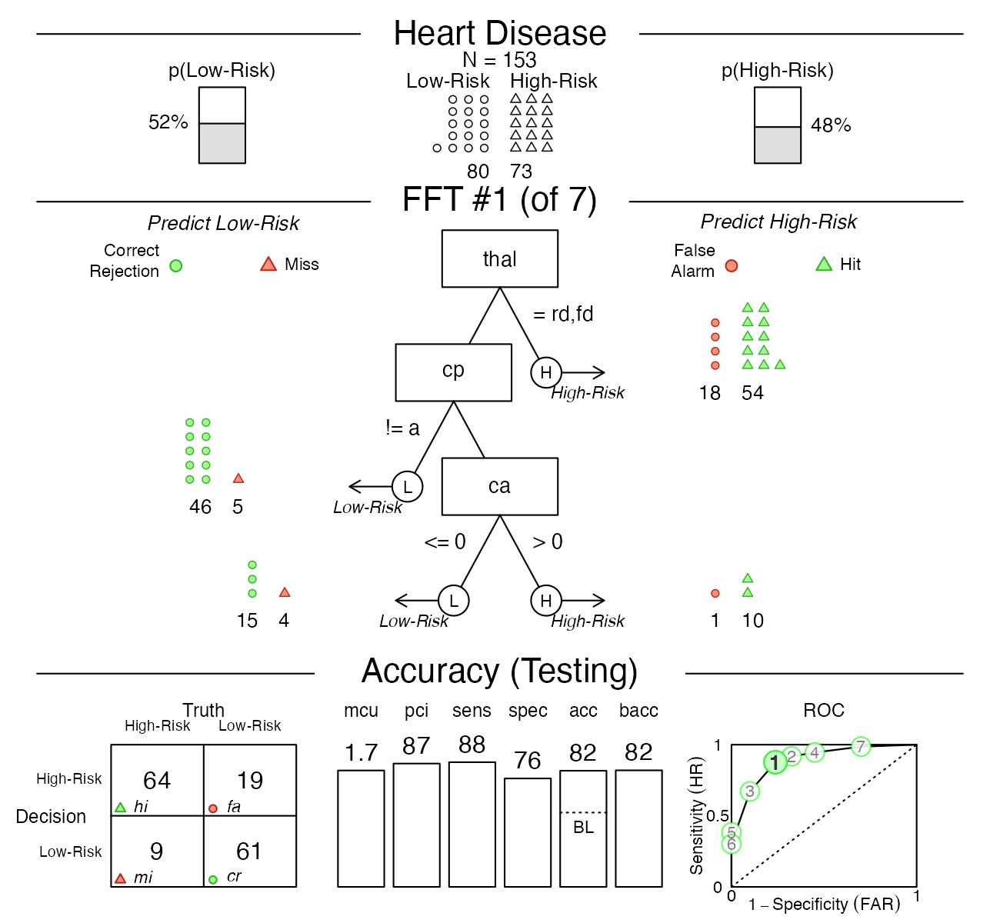
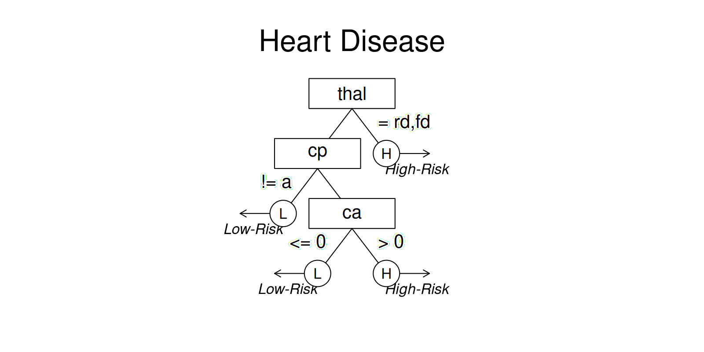
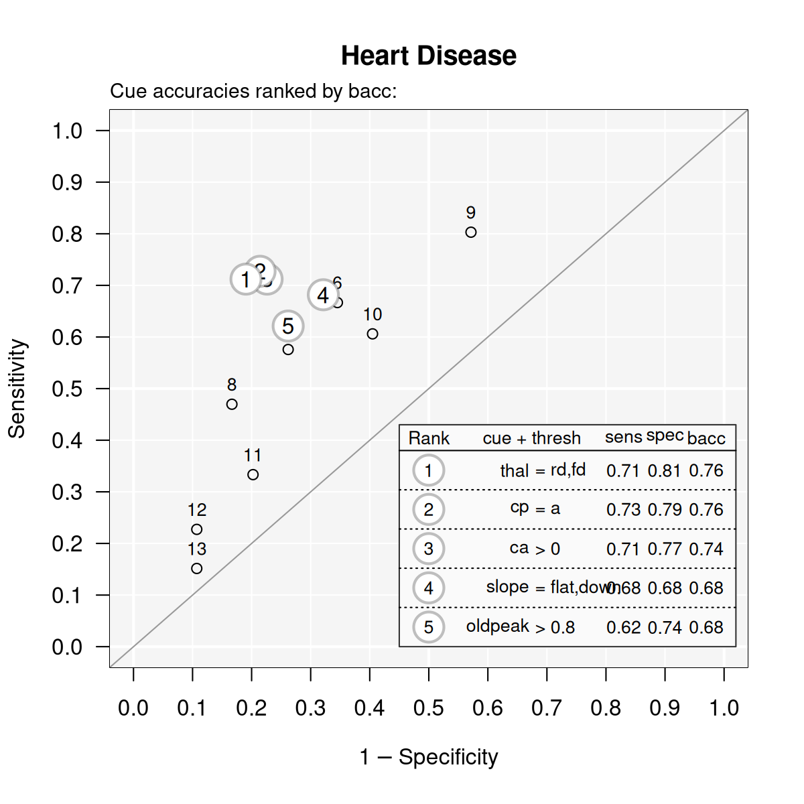

# Tutorial: Creating FFTs for heart disease

## Tutorial: Creating FFTs for heart disease

This tutorial on using the **FFTrees** package follows the examples
presented in Phillips et al. (2017) (freely available in
[html](https://journal.sjdm.org/17/17217/jdm17217.html) \|
[PDF](https://journal.sjdm.org/17/17217/jdm17217.pdf)):

- Phillips, N. D., Neth, H., Woike, J. K. & Gaissmaier, W. (2017).
  FFTrees: A toolbox to create, visualize, and evaluate fast-and-frugal
  decision trees. *Judgment and Decision Making*, *12* (4), 344–368.
  <https://doi.org/10.1017/S1930297500006239>

In the following, we explain how to use **FFTrees** to create, evaluate
and visualize FFTs in four simple steps.

### Step 1: Install and load the FFTrees package

We can install FFTrees from CRAN using
[`install.packages()`](https://rdrr.io/r/utils/install.packages.html).
(We only need to do this once.)

``` r
# Install the package from CRAN:
install.packages("FFTrees")
```

To use the package, we first need to load it into your current R
session. We load the package using
[`library()`](https://rdrr.io/r/base/library.html):

``` r
# Load the package:
library(FFTrees)
```

The **FFTrees** package contains several vignettes that guide through
the package’s functionality (like this one). To open the main guide, run
[`FFTrees.guide()`](https://www.nathanieldphillips.co/FFTrees/reference/FFTrees.guide.md):

``` r
# Open the main package guide: 
FFTrees.guide()
```

### Step 2: Create FFTs from training data (and test on testing data)

In this example, we will create FFTs from a heart disease data set. The
training data are in an object called `heart.train`, and the testing
data are in an object called `heart.test`. For these data, we will
predict `diagnosis`, a binary criterion that indicates whether each
patient has or does not have heart disease (i.e., is at high-risk or
low-risk).

To create an `FFTrees` object, we use the function
[`FFTrees()`](https://www.nathanieldphillips.co/FFTrees/reference/FFTrees.md)
with two main arguments:

1.  `formula` expects a formula indicating a binary criterion variable
    as a function of one or more predictor variable(s) to be considered
    for the tree. The shorthand `formula = diagnosis ~ .` means to
    include all predictor variables.

2.  `data` specifies the training data used to construct the FFTs (which
    must include the criterion variable).

Here is how we can construct our first FFTs:

``` r
# Create an FFTrees object:
heart.fft <- FFTrees(formula = diagnosis ~ .,           # Criterion and (all) predictors
                     data = heart.train,                # Training data
                     data.test = heart.test,            # Testing data
                     main = "Heart Disease",            # General label
                     decision.labels = c("Low-Risk", "High-Risk")  # Decision labels (False/True)
                     )
```

Evaluating this expression runs code that examines the data, optimizes
thresholds based on our current goals for each cue, and creates and
evaluates 7 FFTs. The resulting `FFTrees` object that contains the tree
definitions, their decisions, and their performance statistics, are
assigned to the `heart.fft` object.

#### Other arguments

- `algorithm`: There are two different algorithms available to build
  FFTs `"ifan"` (Phillips et al., 2017) and `"dfan"` (Phillips et al.,
  2017). (`"max"` (Martignon et al., 2008), and `"zigzag"` (Martignon et
  al., 2008) are no longer supported).

- `max.levels`: Changes the maximum number of levels that are allowed in
  the tree.

The following arguments apply when using the “ifan” or “dfan” algorithms
for creating new FFTs:

- `goal.chase`: The `goal.chase` argument changes which statistic is
  maximized during tree construction (for the `"ifan"` and `"dfan"`
  algorithms). Possible arguments include `"acc"`, `"bacc"`, `"wacc"`,
  `"dprime"`, and `"cost"`. The default is `"wacc"` with a sensitivity
  weight of 0.50 (which renders it identical to `"bacc"`).

- `goal`: The `goal` argument changes which statistic is maximized when
  *selecting* trees after construction (for the `"ifan"` and `"dfan"`
  algorithms). Possible arguments include `"acc"`, `"bacc"`, `"wacc"`,
  `"dprime"`, and `"cost"`.

- `my.tree` or `tree.definitions`: We can define a new tree from a
  verbal description (as a set of sentences), or manually specify sets
  of FFTs as a data frame (in appropriate format). See the [Manually
  specifying
  FFTs](https://www.nathanieldphillips.co/FFTrees/articles/FFTrees_mytree.md)
  vignette for details.

### Step 3: Inspect and summarize FFTs

Now we can inspect and summarize the generated decision trees. We will
start by printing the `FFTrees` object to return basic information to
the console:

``` r
# Print an FFTrees object:
heart.fft
```

    #> Heart Disease
    #> FFTrees 
    #> - Trees: 7 fast-and-frugal trees predicting diagnosis
    #> - Cost of outcomes:  hi = 0,  fa = 1,  mi = 1,  cr = 0
    #> - Cost of cues: 
    #>      age      sex       cp trestbps     chol      fbs  restecg  thalach 
    #>        1        1        1        1        1        1        1        1 
    #>    exang  oldpeak    slope       ca     thal 
    #>        1        1        1        1        1 
    #> 
    #> FFT #1: Definition
    #> [1] If thal = {rd,fd}, decide High-Risk.
    #> [2] If cp != {a}, decide Low-Risk.
    #> [3] If ca > 0, decide High-Risk, otherwise, decide Low-Risk.
    #> 
    #> FFT #1: Training Accuracy
    #> Training data: N = 150, Pos (+) = 66 (44%) 
    #> 
    #> |          | True + | True - | Totals:
    #> |----------|--------|--------|
    #> | Decide + | hi  54 | fa  18 |      72
    #> | Decide - | mi  12 | cr  66 |      78
    #> |----------|--------|--------|
    #>   Totals:        66       84   N = 150
    #> 
    #> acc  = 80.0%   ppv  = 75.0%   npv  = 84.6%
    #> bacc = 80.2%   sens = 81.8%   spec = 78.6%
    #> 
    #> FFT #1: Training Speed, Frugality, and Cost
    #> mcu = 1.74,  pci = 0.87
    #> cost_dec = 0.200,  cost_cue = 1.740,  cost = 1.940

The output tells us several pieces of information:

- The tree with the highest weighted sensitivity `wacc` with a
  sensitivity weight of 0.5 is selected as the best tree.

- Here, the best tree, FFT #1 uses three cues: `thal`, `cp`, and `ca`.

- Several summary statistics for this tree in training and test data are
  summarized.

All statistics to evaluate each tree can be derived from a 2 x 2
confusion table:


**Table 1**: A 2x2 confusion table illustrating the types of frequency
counts for 4 possible outcomes.

For definitions of all accuracy statistics, see the [accuracy
statistics](https://www.nathanieldphillips.co/FFTrees/articles/FFTrees_accuracy_statistics.md)
vignette.

### Step 4: Visualise the final FFT

We use `plot(x)` to visualize an FFT (from an `FFTrees` object `x`).
Using `data = "train"` evaluates an FFT for training data (fitting),
whereas `data = "test"` predicts the performance of an FFT for a
different dataset:

``` r
# Plot predictions of the best FFT when applied to test data:
plot(heart.fft,      # An FFTrees object
     data = "test")  # data to use (i.e., either "train" or "test")?
```



#### Other arguments

The [`plot()`](https://rdrr.io/r/graphics/plot.default.html) function
for `FFTrees` object

- `tree`: Which tree in the object should beplotted? To plot a tree
  other than the best fitting tree (FFT \#1), just specify another tree
  as an integer (e.g.; `plot(heart.fft, tree = 2)`).

- `data`: For which dataset should statistics be shown? Either
  `data = "train"` (showing fitting or “Training” performance by
  default), or `data = "test"` (showing prediction or “Testing”
  performance).

- `stats`: Should accuracy statistics be shown with the tree? To show
  only the tree, without any performance statistics, include the
  argument `stats = FALSE`.

``` r
# Plot only the tree, without accuracy statistics:
plot(heart.fft, what = "tree")
```



``` r
# plot(heart.fft, stats = FALSE)  #  The 'stats' argument has been deprecated.
```

- `comp`: Should statistics from competitive algorithms be shown in the
  ROC curve? To remove the performance statistics of competitive
  algorithms (e.g.; regression, random forests), include the argument
  `comp = FALSE`.

- `what`: Which parts of an `FFTrees` object should be visualized (e.g.,
  `all`, `icontree` and `tree`). Using `what = "roc"` plots tree
  performance as an ROC curve. To show individual cue accuracies (in ROC
  space), specify `what = "cues"`:

``` r
# Plot cue accuracies (for training data) in ROC space:
plot(heart.fft, what = "cues")
```

    #> Plotting cue training statistics:
    #> — Cue accuracies ranked by bacc
    #> 



See the [Plotting
FFTrees](https://www.nathanieldphillips.co/FFTrees/articles/FFTrees_plot.md)
vignette for details on plotting FFTs.

### Advanced functions

Creating sets of FFTs and evaluating them on data by printing and
plotting individual FFTs provides the core functionality of **FFTrees**.
However, the package also provides more advanced functions for
accessing, defining, using and evaluating FFTs.

#### Accessing outputs

An `FFTrees` object contains many different outputs. Basic performance
information on the current data and set of FFTs is available by the
[`summary()`](https://rdrr.io/r/base/summary.html) function. To see and
access parts of an `FFTrees` object, use
[`str()`](https://rdrr.io/r/utils/str.html) or
[`names()`](https://rdrr.io/r/base/names.html):

``` r
# Show the names of all outputs in heart.fft:
names(heart.fft)
```

    #> [1] "criterion_name" "cue_names"      "formula"        "trees"         
    #> [5] "data"           "params"         "competition"    "cues"

Key elements of an `FFTrees` object are explained in the vignette on
[Creating FFTs with
FFTrees()](https://www.nathanieldphillips.co/FFTrees/articles/FFTrees_function.md).

#### Predicting for new data

To predict classification outcomes for new data, use the standard
[`predict()`](https://rdrr.io/r/stats/predict.html) function. For
example, here’s how to predict the classifications for data in the
`heartdisease` object (which actually is just a combination of
`heart.train` and `heart.test`):

``` r
# Predict classifications for a new dataset:
predict(heart.fft, 
        newdata = heartdisease)
```

#### Directly defining FFTs

To define a specific FFT and apply it to data, we can define a tree by
providing its verbal description to the `my.tree` argument. Similarly,
we can define sets of FFT definitions (as a data frame) and evaluate
them on data by using the `tree.definitions` argument of
[`FFTrees()`](https://www.nathanieldphillips.co/FFTrees/reference/FFTrees.md).
As we often start from an existing set of FFTs, **FFTrees** provides a
set of functions for extracting, converting, and modifying tree
definitions.

See the vignette on [Manually specifying
FFTs](https://www.nathanieldphillips.co/FFTrees/articles/FFTrees_mytree.md)
for defining FFTs from descriptions and modifying tree definitions.

## Vignettes

Here is a complete list of the vignettes available in the **FFTrees**
package:

|     | Vignette                                                                                                 | Description                                                                                                                        |
|----:|:---------------------------------------------------------------------------------------------------------|:-----------------------------------------------------------------------------------------------------------------------------------|
|     | [Main guide: FFTrees overview](https://www.nathanieldphillips.co/FFTrees/articles/guide.md)              | An overview of the **FFTrees** package                                                                                             |
|   1 | [Tutorial: FFTs for heart disease](https://www.nathanieldphillips.co/FFTrees/articles/FFTrees_heart.md)  | An example of using [`FFTrees()`](https://www.nathanieldphillips.co/FFTrees/reference/FFTrees.md) to model heart disease diagnosis |
|   2 | [Accuracy statistics](https://www.nathanieldphillips.co/FFTrees/articles/FFTrees_accuracy_statistics.md) | Definitions of accuracy statistics used throughout the package                                                                     |
|   3 | [Creating FFTs with FFTrees()](https://www.nathanieldphillips.co/FFTrees/articles/FFTrees_function.md)   | Details on the main [`FFTrees()`](https://www.nathanieldphillips.co/FFTrees/reference/FFTrees.md) function                         |
|   4 | [Manually specifying FFTs](https://www.nathanieldphillips.co/FFTrees/articles/FFTrees_mytree.md)         | How to directly create FFTs without using the built-in algorithms                                                                  |
|   5 | [Visualizing FFTs](https://www.nathanieldphillips.co/FFTrees/articles/FFTrees_plot.md)                   | Plotting `FFTrees` objects, from full trees to icon arrays                                                                         |
|   6 | [Examples of FFTs](https://www.nathanieldphillips.co/FFTrees/articles/FFTrees_examples.md)               | Examples of FFTs from different datasets contained in the package                                                                  |

## References

Martignon, L., Katsikopoulos, K. V., & Woike, J. K. (2008).
Categorization with limited resources: A family of simple heuristics.
*Journal of Mathematical Psychology*, *52*(6), 352–361.
<https://doi.org/10.1016/j.jmp.2008.04.003>

Phillips, N. D., Neth, H., Woike, J. K., & Gaissmaier, W. (2017).
FFTrees: A toolbox to create, visualize, and evaluate fast-and-frugal
decision trees. *Judgment and Decision Making*, *12*(4), 344–368.
<https://doi.org/10.1017/S1930297500006239>
